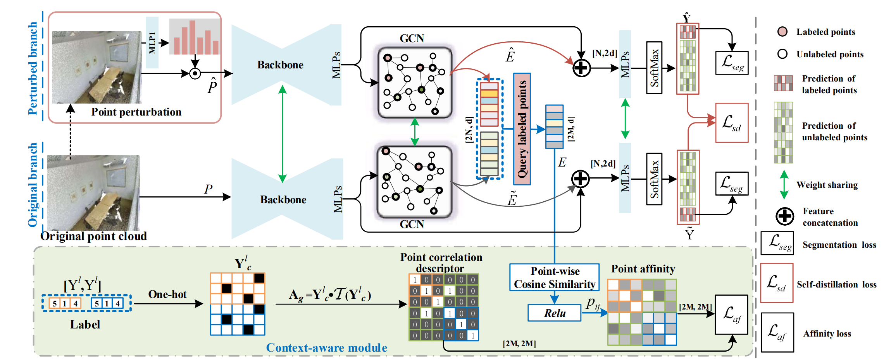

# Perturbed Self-Distillation: Weakly Supervised Large-Scale Point Cloud Semantic Segmentation

# Contents

- [PSD](#psd)
    - [Model Architecture](#model-architecture)
    - [Requirements](#requirements)
        - [Install dependencies](#install-dependencies)
    - [Dataset](#dataset)
        - [Preparation](#preparation)
        - [Directory structure of dataset](#directory-structure-of-dataset)
    - [Quick Start](#quick-start)
    - [Script Description](#script-description)
        - [Scripts and Sample Code](#scripts-and-sample-code)
        - [Script Parameter](#script-parameter)
    - [Training](#training)
        - [Training Process](#training-process)
        - [Training Result](#training-result)
    - [Evaluation](#evaluation)
        - [Evaluation Process](#evaluation-process)
        - [Evaluation Result 910](#evaluation-result-910)
    - [Performance](#performance)
        - [Training Performance](#training-performance)
        - [Inference Performance](#inference-performance)
        - [S3DIS Area 5](#s3dis-area-5)
    - [Reference](#reference)

# [PSD](#contents)

Mindspore implementation for ***"Perturbed Self-Distillation: Weakly Supervised Large-Scale Point Cloud Semantic Segmentation"***

Please read the [original paper](https://openaccess.thecvf.com/content/ICCV2021/papers/Zhang_Perturbed_Self-Distillation_Weakly_Supervised_Large-Scale_Point_Cloud_Semantic_Segmentation_ICCV_2021_paper.pdf)
or [original tensorflow implementation](https://github.com/Yachao-Zhang/PSD) for more detailed information.

## [Model Architecture](#contents)



## [Requirements](#contents)

- Hardware
    - For Ascend: Ascend 910.
    - For GPU: cuda==11.1

- Framework
    - Mindspore = 1.7.0

- Third Package
    - Python==3.7.5
    - pandas==1.3.5
    - scikit-learn==0.21.3
    - numpy==1.21.5

### [Install dependencies](#contents)

1. `pip install -r requirements.txt`
2. `cd third_party` & `bash compile_op.sh`

## [Dataset](#contents)

### [Preparation](#contents)

1. Download S3DIS dataset from
   this [link](https://docs.google.com/forms/d/e/1FAIpQLScDimvNMCGhy_rmBA2gHfDu3naktRm6A8BPwAWWDv-Uhm6Shw/viewform?c=0&w=1)
   .
2. Uncompress `Stanford3dDataset_v1.2_Aligned_Version.zip` to `dataset/S3DIS`.
3. run `data_prepare_s3dis.py` (in `src/utils/data_prepare_s3dis.py`) to process data. The processed data will be stored
   in `input_0.040` and `original_ply` folders.

### [Directory structure of dataset](#contents)

```html
dataset
└──S3DIS                                     #  S3DIS dataset
   ├── input_0.040
   │   ├── *.ply
   │   ├── *_proj.pkl
   │   └── *_KDTree.pkl
   ├── original_ply
   │   └── *.ply
   │
   └── Stanford3dDataset_v1.2_Aligned_Version
```

## [Quick Start](#contents)

For GPU:

```shell
bash scripts/train_s3dis_area5_gpu.sh
bash scripts/eval_s3dis_area5_gpu.sh
```

For Ascend:

```shell
bash scripts/train_s3dis_area5_ascend.sh
bash scripts/eval_s3dis_area5_ascend.sh
```

## [Script Description](#contents)

### [Scripts and Sample Code](#contents)

```html
PSD
├── scripts
│   ├── eval_s3dis_area5_ascend.sh           # Evaluate: S3DIS Area 5 on Ascend
│   ├── eval_s3dis_area5_gpu.sh              # Evaluate: S3DIS Area 5 on GPU
│   ├── train_s3dis_area5_ascend.sh          # Train: S3DIS Area 5 on Ascend
│   └── train_s3dis_area5_gpu.sh             # Train: S3DIS Area 5 on GPU
├── src
|   ├── data                                 # class and functions for Mindspore dataset
│   │   └── dataset.py                  # dataset class for train
│   ├── model                                # network architecture and loss function
│   │   ├── model.py                         # network architecture
│   │   └── loss.py                          # loss function with mask
│   └── utils
│       ├── data_prepare_s3dis.py            # data processor for s3dis dataset
│       ├── helper_ply.py                    # file utils
│       ├── logger.py                        # logger
│       └── tools.py                         # DataProcessing and Config
├── third_party
|   ├── cpp_wrappers                         # dependency for point cloud subsampling
|   ├── meta                                 # meta information for data processor
|   ├── nearest_neighbors                    # dependency for point cloud nearest_neighbors
|   └── compile_op.sh                        # shell for installing dependencies, including cpp_wrappers and nearest_neighbors
|
├── eval.py
├── README.md
├── requirements.txt
└── train.py
```

### [Script Parameter](#contents)

we use `train_s3dis_area5_gpu.sh` as an example

```shell
python train.py \
  --epochs 100 \
  --batch_size 3 \
  --labeled_point 1% \
  --val_area 5 \
  --scale \
  --device_target GPU \
  --device_id 0 \
  --outputs_dir ./runs \
  --name psd_Area-5_1%-gpu
```

The following table describes the arguments. Some default Arguments are defined in `src/utils/tools.py`. You can change freely as you want.

| Config Arguments  |                         Explanation                          |
| :---------------: | :----------------------------------------------------------: |
| `--epoch`            | number of epochs for training |
| `--batch_size`       | batch size |
| `--labeled_point`    | the percent of labeled points  |
| `--val_area`         | which area to validate              |
| `--scale`            | use auto loss scale or not              |
| `--device_target`    | chose "Ascend" or "GPU" |
| `--device_id`        | which Ascend AI core/GPU to run(default:0) |
| `--outputs_dir`      | where stores log and network weights  |
| `--name`             | experiment name, which will combine with outputs_dir. The output files for current experiments will be stores in `outputs_dir/name`  |

## [Training](#contents)

### [Training Process](#contents)

For GPU on S3DIS area 5:

```shell
bash scripts/train_s3dis_area5_gpu.sh
```

For Ascend on S3DIS area 5:

```shell
bash scripts/train_s3dis_area5_ascend.sh
```

### [Training Result](#contents)

Using `bash scripts/train_s3dis_area5_ascend.sh` as an example:

Training results will be stored in `/runs/randla_Area-5-ascend` , which is determined
by `{args.outputs_dir}/{args.name}/ckpt`. For example:

```html
runs
├── psd_Area-5_1%-ascend
    ├── 2022-10-24_time_11_23_40_rank_0.log
    └── ckpt
         ├── psd_1_500.ckpt
         ├── psd_2_500.ckpt
         └── ....
```

## [Evaluation](#contents)

### [Evaluation Process](#contents)

For GPU on S3DIS area 5:

```shell
bash scripts/eval_s3dis_area5_gpu.sh
```

For Ascend on S3DIS area 5:

```shell
bash scripts/eval_s3dis_area5_ascend.sh
```

Note: Before you start eval, please guarantee `--model_path` is equal to
`{args.outputs_dir}/{args.name}` when training.

### [Evaluation Result 910](#contents)

```shell
Area_5_office_7 Acc:0.9041113067021165
Area_5_office_8 Acc:0.9275495811539627
Area_5_office_9 Acc:0.9148316688815217
Area_5_pantry_1 Acc:0.7491346195167732
Area_5_storage_1 Acc:0.548297892030687
Area_5_storage_2 Acc:0.6088499408560052
Area_5_storage_3 Acc:0.6915710558397612
Area_5_storage_4 Acc:0.8207511533037065
--------------------------------------------------------------------------------------
62.60 | 91.18 97.17 80.25  0.00 25.34 61.63 42.77 74.73 84.01 69.02 69.27 67.84 50.60
--------------------------------------------------------------------------------------
```

## [Performance](#contents)

### [Training Performance](#contents)

| Parameters                 | Ascend 910                                                   | GPU (3090) |
| -------------------------- | ------------------------------------------------------------ | ----------------------------------------------|
| Model Version              | PSD                                                          | PSD                                           |
| Resource                   | Ascend 910; CPU 2.60GHz, 24cores; Memory 96G; OS Euler2.8    | Nvidia GeForce RTX 3090                       |
| uploaded Date              | 11/26/2022 (month/day/year)                                  | 11/26/2022 (month/day/year)                   |
| MindSpore Version          | 1.7.0                                                        | 1.7.0                                         |
| Dataset                    | S3DIS                                                        | S3DIS                                         |
| Training Parameters        | epoch=100, batch_size = 3                                    | epoch=100, batch_size = 3                     |
| Optimizer                  | Adam                                                         | Adam                                          |
| Loss Function              | Softmax Cross Entropy                                        | Softmax Cross Entropy                         |
| outputs                    | feature vector + probability                                 | feature vector + probability                  |
| Speed                      | 3800 ms/step                                                 | 590 ms/step                                   |
| Total time                 | About 52 h 47 mins                                           | About 8 h 14 mins                             |
| Checkpoint                 | 57.26 MB (.ckpt file)                                        | 57.26 MB (.ckpt file)                         |

### [Inference Performance](#contents)

| Parameters          | Ascend                      |   GPU                      |
| ------------------- | --------------------------- |--------------------------- |
| Model Version       | PSD                         | PSD                        |
| Resource            | Ascend 910; OS Euler2.8     | Nvidia GeForce RTX 3090    |
| Uploaded Date       | 11/26/2022 (month/day/year) | 11/26/2022 (month/day/year)|
| MindSpore Version   | 1.7.0                       | 1.7.0                      |
| Dataset             | S3DIS                       | S3DIS                      |
| batch_size          | 20                          | 20                         |
| outputs             | feature vector + probability| feature vector + probability  |
| Accuracy            | See following tables        | See following tables       |

### [S3DIS Area 5](#contents)

| Metric | Setting   | Value(Tensorflow)|  Value(Mindspore, Ascend) |    Value(Mindspore, GPU)      |
| :----: | :-----:   | :------------:   |  :-------------------: |       :-------------------:      |
| mIoU   |    1%     |       62.0%      |         62.6%         |               60.9%               |

## [Reference](#contents)

Please kindly cite the original paper references in your publications if it helps your research:

```html
@inproceedings{zhang2021perturbed,
  title={Perturbed self-distillation: Weakly supervised large-scale point cloud semantic segmentation},
  author={Zhang, Yachao and Qu, Yanyun and Xie, Yuan and Li, Zonghao and Zheng, Shanshan and Li, Cuihua},
  booktitle={Proceedings of the IEEE/CVF International Conference on Computer Vision},
  pages={15520--15528},
  year={2021}
}
```